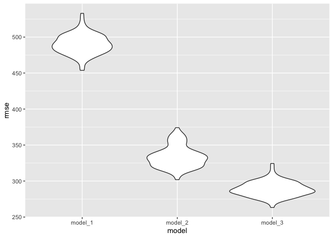

p8105_hw6_yg2762
================
Yang Gao

``` r
library(tidyverse)
```

    ## ── Attaching packages ─────────────────────────────────────── tidyverse 1.3.1 ──

    ## ✓ ggplot2 3.3.5     ✓ purrr   0.3.4
    ## ✓ tibble  3.1.6     ✓ dplyr   1.0.7
    ## ✓ tidyr   1.1.4     ✓ stringr 1.4.0
    ## ✓ readr   2.1.0     ✓ forcats 0.5.1

    ## ── Conflicts ────────────────────────────────────────── tidyverse_conflicts() ──
    ## x dplyr::filter() masks stats::filter()
    ## x dplyr::lag()    masks stats::lag()

``` r
library(modelr)
library(mgcv)
```

    ## Loading required package: nlme

    ## 
    ## Attaching package: 'nlme'

    ## The following object is masked from 'package:dplyr':
    ## 
    ##     collapse

    ## This is mgcv 1.8-38. For overview type 'help("mgcv-package")'.

## Problem 2

``` r
birthweight = read_csv ("./birthweight.csv") %>% 
  mutate(babysex = recode(babysex, `1` = "male", `2` = "female")) %>% 
  mutate(frace = recode (frace, `1`="White",`2` = "Black", `3` = "Asian", 
                                      `4` ="Putero Rican",`8`="other", `9` = "Unknown")) %>% 
  mutate(mrace = recode (mrace, `1`="White",`2` = "Black", `3` = "Asian", 
                                      `4` ="Putero Rican",`8`="other"))
```

    ## Rows: 4342 Columns: 20

    ## ── Column specification ────────────────────────────────────────────────────────
    ## Delimiter: ","
    ## dbl (20): babysex, bhead, blength, bwt, delwt, fincome, frace, gaweeks, malf...

    ## 
    ## ℹ Use `spec()` to retrieve the full column specification for this data.
    ## ℹ Specify the column types or set `show_col_types = FALSE` to quiet this message.

``` r
model_1 = lm(bwt ~ delwt, data = birthweight)
```

``` r
model_1_df = birthweight %>% 
  select(bwt, delwt) %>% 
  modelr::add_residuals(model_1) %>% 
  modelr::add_predictions(model_1)
```

``` r
model_1_df %>% 
  ggplot(aes(x=delwt, y=resid)) + geom_violin()
```

<!-- -->

``` r
cv_df = 
  crossv_mc(birthweight, 100) %>% 
  mutate(
    train = map(train, as_tibble),
    test = map(test, as_tibble)) %>% 
  mutate(
    model_1 = map(train, ~lm(bwt ~ delwt, data = .x)),
    model_2 = map(train, ~lm(bwt ~ blength + gaweeks, data = .x)),
    model_3 = map(train, ~lm(bwt ~ bhead + blength + babysex + bhead*blength + bhead*babysex + blength*babysex + 
                                   bhead*blength*babysex, data = .x))) %>% 
  mutate(
   rmse_model_1 = map2_dbl(model_1, test, ~rmse(model = .x, data = .y)),
   rmse_model_2 = map2_dbl(model_2, test, ~rmse(model = .x, data = .y)),
   rmse_model_3 = map2_dbl(model_3, test, ~rmse(model = .x, data = .y)))
```

``` r
cv_df_plot = cv_df %>% 
  select(starts_with("rmse")) %>% 
  pivot_longer(
    everything(),
    names_to = "model", 
    values_to = "rmse",
    names_prefix = "rmse_") %>% 
  mutate(model = fct_inorder(model)) %>% 
  ggplot(aes(x = model, y = rmse)) + geom_violin()

cv_df_plot
```

<!-- -->
