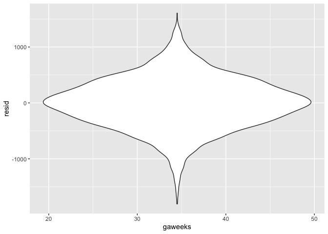
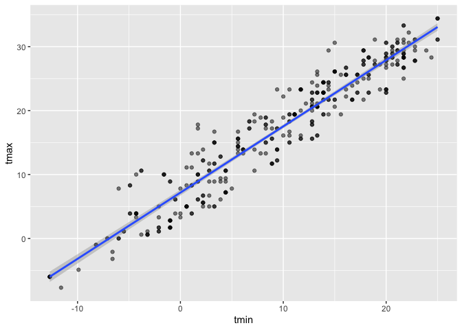
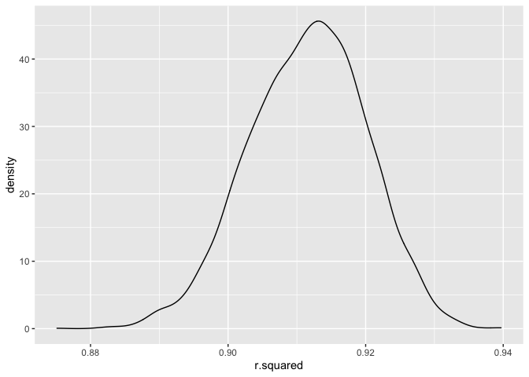

p8105_hw6_yg2762
================
Yang Gao

``` r
library(tidyverse)
```

    ## ── Attaching packages ─────────────────────────────────────── tidyverse 1.3.1 ──

    ## ✓ ggplot2 3.3.5     ✓ purrr   0.3.4
    ## ✓ tibble  3.1.6     ✓ dplyr   1.0.7
    ## ✓ tidyr   1.1.4     ✓ stringr 1.4.0
    ## ✓ readr   2.1.0     ✓ forcats 0.5.1

    ## ── Conflicts ────────────────────────────────────────── tidyverse_conflicts() ──
    ## x dplyr::filter() masks stats::filter()
    ## x dplyr::lag()    masks stats::lag()

``` r
library(modelr)
library(mgcv)
```

    ## Loading required package: nlme

    ## 
    ## Attaching package: 'nlme'

    ## The following object is masked from 'package:dplyr':
    ## 
    ##     collapse

    ## This is mgcv 1.8-38. For overview type 'help("mgcv-package")'.

## Problem 2

``` r
birthweight = 
  read_csv("./birthweight.csv") %>% 
  janitor::clean_names() %>%
  mutate(
    babysex = as.factor(babysex),
    babysex = fct_recode(babysex, "male" = "1", "female" = "2"),
    frace = as.factor(frace),
    frace = fct_recode(frace, "white" = "1", "black" = "2", "asian" = "3", 
                       "puerto rican" = "4", "other" = "8"),
    malform = as.logical(malform),
    mrace = as.factor(mrace),
    mrace = fct_recode(mrace, "white" = "1", "black" = "2", "asian" = "3", 
                       "puerto rican" = "4")) 
```

    ## Rows: 4342 Columns: 20

    ## ── Column specification ────────────────────────────────────────────────────────
    ## Delimiter: ","
    ## dbl (20): babysex, bhead, blength, bwt, delwt, fincome, frace, gaweeks, malf...

    ## 
    ## ℹ Use `spec()` to retrieve the full column specification for this data.
    ## ℹ Specify the column types or set `show_col_types = FALSE` to quiet this message.

``` r
model_1 = lm(bwt ~ delwt, data = birthweight)
```

``` r
model_1_df = birthweight %>% 
  select(bwt, delwt) %>% 
  modelr::add_residuals(model_1) %>% 
  modelr::add_predictions(model_1)
```

``` r
model_1_df %>% 
  ggplot(aes(x=delwt, y=resid)) + geom_violin()
```

<!-- -->

``` r
cv_df = 
  crossv_mc(birthweight, 100) %>% 
  mutate(
    train = map(train, as_tibble),
    test = map(test, as_tibble)) %>% 
  mutate(
    model_1 = map(train, ~lm(bwt ~ delwt, data = .x)),
    model_2 = map(train, ~lm(bwt ~ blength + gaweeks, data = .x)),
    model_3 = map(train, ~lm(bwt ~ bhead + blength + babysex + bhead*blength + bhead*babysex + blength*babysex + 
                                   bhead*blength*babysex, data = .x))) %>% 
  mutate(
   rmse_model_1 = map2_dbl(model_1, test, ~rmse(model = .x, data = .y)),
   rmse_model_2 = map2_dbl(model_2, test, ~rmse(model = .x, data = .y)),
   rmse_model_3 = map2_dbl(model_3, test, ~rmse(model = .x, data = .y)))
```

``` r
cv_df_plot = cv_df %>% 
  select(starts_with("rmse")) %>% 
  pivot_longer(
    everything(),
    names_to = "model", 
    values_to = "rmse",
    names_prefix = "rmse_") %>% 
  mutate(model = fct_inorder(model)) %>% 
  ggplot(aes(x = model, y = rmse)) + geom_violin()

cv_df_plot
```

<!-- -->

According to the cross validation results, `model_3`is the best model
for the data compared to the other two.

## Problem 2

``` r
weather_df = 
  rnoaa::meteo_pull_monitors(
    c("USW00094728"),
    var = c("PRCP", "TMIN", "TMAX"), 
    date_min = "2017-01-01",
    date_max = "2017-12-31") %>%
  mutate(
    name = recode(id, USW00094728 = "CentralPark_NY"),
    tmin = tmin / 10,
    tmax = tmax / 10) %>%
  select(name, id, everything())
```

    ## Registered S3 method overwritten by 'hoardr':
    ##   method           from
    ##   print.cache_info httr

    ## using cached file: ~/Library/Caches/R/noaa_ghcnd/USW00094728.dly

    ## date created (size, mb): 2021-11-26 17:55:56 (7.613)

    ## file min/max dates: 1869-01-01 / 2021-11-30

``` r
boot_sample = function(df) {
  sample_frac(df, replace = TRUE)
}
```

### Check for the `boot_sample`

``` r
boot_sample(weather_df) %>% 
  ggplot(aes(x = tmin, y = tmax)) + 
  geom_point(alpha = .5) +
  stat_smooth(method = "lm")
```

    ## `geom_smooth()` using formula 'y ~ x'

<!-- -->

### Run bootstrap

``` r
boot_straps = 
  tibble(
    strap_number = 1:5000,
    strap_sample = rerun(5000, boot_sample(weather_df))
  )
```

``` r
r_results = boot_straps %>% 
  mutate(
    models = map(strap_sample, ~lm(tmax ~ tmin, data = .x)),
    r_results = map(models, broom::glance)) %>% 
  select(-strap_sample, -models) %>% 
  unnest(r_results)
```

``` r
r_results %>% 
  ggplot(aes(x = r.squared)) + geom_density()
```

<!-- -->

The distribution of R-squared is relatively normal with a little tail to
lower values, indicating there might have large outliers in the boot
strap sample.

``` r
r_results %>% 
  summarise (
    ci_lower = quantile(r.squared, 0.025), 
    ci_upper = quantile(r.squared, 0.975)) %>% 
  knitr::kable()
```

| ci_lower |  ci_upper |
|---------:|----------:|
| 0.893385 | 0.9267641 |

``` r
beta_results = boot_straps %>% 
  mutate(
    models = map(strap_sample, ~lm(tmax ~ tmin, data = .x) ),
    beta_results = map(models, broom::tidy)) %>% 
  select(-strap_sample, -models) %>% 
  unnest(beta_results) 
```

``` r
log_beta = beta_results %>% 
  select(strap_number,term,estimate) %>% 
  pivot_wider(
    names_from = term,
    values_from = estimate
  ) %>% 
  mutate(log = log(`(Intercept)`* `tmin`))

ggplot(log_beta,aes(x = log)) + geom_density()
```

<!-- -->

The distribution of log(beta_0 \*beta) is normal.

``` r
log_beta %>% 
  summarise(
     ci_lower = quantile(log, 0.025), 
    ci_upper = quantile(log, 0.975)) %>% 
  knitr::kable()
```

| ci_lower | ci_upper |
|---------:|---------:|
| 1.965507 |  2.05862 |
